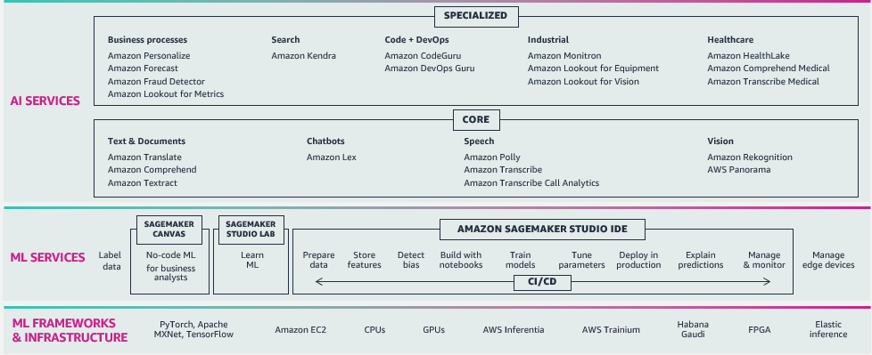

# AWS ML JP

AWS で機械学習をはじめる方法を学ぶことができるリポジトリです。

## :books: リポジトリの構成

* `ai-services`
  * AWS の AI サービスの使い方を学ぶためのコンテンツ。
* `sagemaker`
  * 機械学習モデルの開発効率化やパイプライン化を検討している方が、 Amazon SageMaker をどう使えば実現できるか学ぶためのコンテンツ。
* `frameworks`
  * すでに TensorFlow や PyTorch で開発している方が、モデルを SageMaker 上で学習、推論させるための移行方法を学ぶためのコンテンツ。
* `tasks`
  * 画像のセグメンテーションや物体検知、自然言語処理のQAや要約など、個別具体的なタスクを SageMaker でどのように解けるか学ぶためのコンテンツ。
* `solutions`
  * 製造業での異常検知モニタリングやコールセンターの問合せ分析など、特定の業務プロセスを効率化/差別化したい方が、 SageMaker と他のサービスを組み合わせどのようにソリューションを構築できるか学ぶためのコンテンツ。

## :hamburger: AWSの機械学習サービス

AWS の機械学習サービスは **AI Services** 、 **ML Services** 、 **ML Frameworks/Infrastructure** の 3 層構成になっています。リポジトリの構成はサービスの構成を踏襲しています。

* [AI Services](https://aws.amazon.com/jp/machine-learning/ai-services/)
   * アプリケーション開発者の方がWeb API形式で簡単に機械学習機能を扱えるサービスです。代表的なサービスを以下に 2 つ紹介しますが、 20 を超える AI サービスを提供しています。
   * [Amazon Personalize](https://aws.amazon.com/jp/personalize/) は推薦機能が実装できるサービス ([BASE様の事例](https://devblog.thebase.in/entry/2021/12/17/110000))
   * [Amazon Rekognition](https://aws.amazon.com/jp/rekognition/) は顔やブランドロゴの検出といった画像認識機能を実装できるサービス([千株式会社様の顔検索事例](https://sencorp.co.jp/4713/), [TRUSTDOCK 社の本人確認事例](https://aws.amazon.com/jp/blogs/startup/tech-interview-trustdock-2023/))です。
* [ML Servies](https://aws.amazon.com/jp/machine-learning/)
   * データサイエンティストの方が機械学習モデルを開発する時、前処理、計算資源の調達、学習結果の管理やモデルのデプロイなど面倒な作業を代行するとともにスケールしやすくするサービスです。
   * [Amazon SageMaker](https://aws.amazon.com/jp/sagemaker/) は機械学習モデル開発を行うための統合開発環境で、 JupyterLab をベースにした環境からデータの前処理、学習、デプロイなどに必要なサービスを簡単に呼び出せます([三菱 UFJ 様の事例](https://pages.awscloud.com/rs/112-TZM-766/images/20210408_AIML_Tokyo_MTEC.pdf)、 [Denso 様の事例](https://aws.amazon.com/jp/solutions/case-studies/denso/)、 [SyntheticGestalt](https://aws.amazon.com/jp/blogs/startup/syntheticgestalt_2022casestudy/)(創薬)、)。
   * [Amazon SageMaker Studio Lab](https://studiolab.sagemaker.aws/) は無料で利用できるエントリー版ですが、 GPU やストレージなど機械学習の学びから価値検証に十分なスペックを備えています。
   * [Amazon SageMaker Canvas](https://aws.amazon.com/jp/sagemaker/canvas/) は機械学習の専門知識がない業務部門の方でも表計算ソフトの延長線の感覚で機械学習モデルの構築と予測が行えるサービスです。
* [ML Frameworks/Infrastructure](https://aws.amazon.com/jp/machine-learning/infrastructure/?nc1=h_ls)
   * データサイエンティストの方が機械学習モデルを開発する時、利用したい機械学習フレームワークやデバイスに合わせた環境をセットアップしやすくするサービスです。
   * [AWS Deep Learning Containers](https://aws.amazon.com/jp/machine-learning/containers/) は各種フレームワークごとに最適化されたコンテナイメージで学習・推論が高速化されます。
   * [AWS Inferentia](https://aws.amazon.com/jp/machine-learning/inferentia/) は推論 ([MoneyForward 様の事例](https://youtu.be/dVlNobmvoTg) )、 [AWS Trainium](https://aws.amazon.com/jp/machine-learning/trainium/) は学習にそれぞれ特化したチップで、高スループットかつ高コスト効率な推論、学習を可能にします。

## ✏️ 学習の準備

本リポジトリのコンテンツは主に Jupyter Notebook で作成されています。コンテンツを動かすため、次の準備をしておいてください。セットアップの詳細は、コンテンツ本体の記載も参照してください。

* [AWS アカウントの作成](https://aws.amazon.com/jp/register-flow/)
* [SageMaker Studio Domainの作成](https://docs.aws.amazon.com/ja_jp/sagemaker/latest/dg/onboard-quick-start.html)
* [S3 bucketの作成](https://docs.aws.amazon.com/ja_jp/AmazonS3/latest/userguide/create-bucket-overview.html)
* [IAM ユーザー、ロールの作成](https://docs.aws.amazon.com/ja_jp/IAM/latest/UserGuide/introduction.html)
  * 必要に応じ、コンテンツで動かすサービスにとって適切なユーザー、ロールを作成します。

## 🎥 学習コンテンツ

### AI Service

* Amazon Forecast
   * [Amazon Forecast による電気使用量の予測](./ai-services/forecast/amazon_forecast_tutorial/forecast_electricityusagedata.ipynb)
* Amazon Personalize
   * [Amazon Personalize による映画の推薦](./ai-services/personalize/personalize-tutorial/personalize_handson.ipynb)

### Amazon SageMaker

AI/ML の BlackBelt シリーズである [AI/ML DarkPart](https://www.youtube.com/playlist?list=PLAOq15s3RbuL32mYUphPDoeWKUiEUhcug) で SageMaker の使い方を解説しています！ そもそも機械学習のプロジェクトはどうやって始めればいいのかに疑問をお持ちの方は、 [AI/ML LightPart](https://www.youtube.com/playlist?list=PLAOq15s3RbuJ81DBtH66tQL2_9H519ODQ) の動画や [ML Enablement Workshop](https://github.com/aws-samples/aws-ml-enablement-workshop) の資料をご参考ください。

|No   |Process|Title|Content|Video|
|:----|:------|:----|:----|:----|
|1    |Train|Amazon SageMaker Training で機械学習のモデル開発を楽にする| - ||
|2    |Train|Amazon SageMaker Training ハンズオン編|||
|3    |Train|Amazon SageMaker による実験管理|||
|4    |Deploy|Amazon SageMaker 推論 Part1 推論の頻出課題とSageMakerによる解決方法| - ||
|5    |Deploy|Amazon SageMaker 推論 Part2すぐにプロダクション利用できる！モデルをデプロイして推論する方法 |||
|6    |Deploy|Amazon SageMaker 推論 Part3（前編）もう悩まない！機械学習モデルのデプロイパターンと戦略 | - ||
|7    |Deploy|Amazon SageMaker 推論 Part3（後編）もう悩まない！機械学習モデルのデプロイパターンと戦略 | - ||
|8   |Monitor|Amazon SageMaker モニタリング Part1 | - ||
|9    |Monitor|Amazon SageMaker モニタリング Part2 |||
|10    |Monitor|Amazon SageMaker モニタリング Part3 |||

[Amazon SageMakerの概要](./sagemaker/) では Amazon SageMaker の全体像と動画で解説しているコードも含めたコンテンツの詳細を確認できます。

## 📝 実践コンテンツ

AWS で機械学習を実践する時の参考となるサンプルコードなどを紹介します。

### Amazon SageMaker

Amazon SageMaker で機械学習の構築、学習、デプロイをスケールする。

#### 📯 MLOps

* [Amazon SageMaker Neo で学習したモデルをコンパイルし、 AWS IoT Greengrass V2 でエッジにデプロイする](sagemaker/mlops/edge-deploy/sagemaker-neo-greengrass-v2-deploy.ipynb)
* [Amazon SageMaker Pipelines で離反予測を題材にモデルの学習・評価・更新プロセスを構築する](./sagemaker/mlops/sagemaker-pipelines/sagemaker-pipelines-sample/sagemaker-pipelines-sample.ipynb)
* [Amazon SageMaker Processing と AWS Step Functions でモデルの学習・評価・更新プロセスを構築する](./sagemaker/mlops/step-functions-data-science-sdk/step_functions_mlworkflow_scikit_learn_data_processing_and_model_evaluation_with_experiments.ipynb)
* [Amazon SageMaker Processing と AWS Step Functions でモデルの学習・評価・更新プロセスを構築する (Studio 版 )](./sagemaker/mlops/step-functions-data-science-sdk/studio_step_functions_mlworkflow_scikit_learn_data_processing_and_model_evaluation_with_experiments.ipynb)

### 🚚 ML Frameworks

機械学習フレームワークの実装を SageMaker へ移行する。

* PyTorch
  * [学習済みモデルの推論](frameworks/pytorch/inference/pytorch-deeplab.ipynb)
* TensorFlow
  * [モデルの学習](frameworks/tensorflow/training/tensorflow2_training_and_serving.ipynb)
  * [学習済みモデルの推論](frameworks/tensorflow/inference/TF2-model-deploy.ipynb)

### Tasks

AWS で画像処理や自然言語処理などの機械学習のタスクを解く方法を解説します。

#### 👁 画像処理

* 物体検知
  * [Detectron2 を用いた物体検知](./tasks/vision/object_detection/amazon-sagemaker-pytorch-detectron2/README.md)
* 画像分類
  * [SageMaker のビルトインアルゴリズム (Image Classification) を用いた肺 CT 画像からの COVID-19 診断](./tasks/vision/image_classification/covid19-built-in-image-classification.ipynb)
* OCR
  * [PaddleOCR を用いた文字読み取り](./tasks/vision/ocr/paddleocr.ipynb)

#### 💬 自然言語処理

* テキスト分類
   * [SageMaker のビルトインアルゴリズム (BlazingText) を用いた商品レビューセットの感情分析](./tasks/nlp/BlazingText/blazingtext.ipynb)
   * [Gluon NLP で BERT を用いた感情分析](./tasks/nlp/text_classification/GluonNLP/gluonnlp_bert.ipynb)

#### 🔈 音声処理

* 自動発話認識
  * [Wav2Vec / Whisper を用いた自動発話認識](./tasks/audio/automatic_speech_recognition/studio-lab-wav2vec-whisper/wav2vec.ipynb)

#### 📄  テーブルデータ

* 回帰
  * [AutoGluon を用いたダイレクトマーケティングの成功可否予測](./tasks/tabular/regression/AutoGluon-Tabular-with-SageMaker/AutoGluon_Tabular_SageMaker.ipynb)
  * [XGBoost による顧客の解約率予測](./tasks/tabular/regression/customer_churn/xgboost_customer_churn.ipynb)
* 分類
  * [細胞診 (FNA) 結果からの乳がん診断](./tasks/tabular/classification/BreastCancerPrediction_R.ipynb)

#### 🤖 生成系 AI

##### `text-to-image`

**[Stable Diffusion Web UI](./tasks/generative-ai/text-to-image/inference/stable-diffusion-webui/)**
> Stable Diffusion の GUI として人気の [AUTOMATIC1111/stable-diffusion-webui](https://github.com/AUTOMATIC1111/stable-diffusion-webui) を EC2 インスタンスに立てて利用できるようにする CloudFormation です。モデルのトレーニングに [bmaltais/kohya_ss](https://github.com/bmaltais/kohya_ss)、GUI ベースのファイル操作に [filebrowser/filebrowser](https://github.com/filebrowser/filebrowser) を立ち上げる構成も含まれています。SageMaker JumpStart を利用した Fine Tuning については [たった数枚の画像で Stable Diffusion をファインチューニングできる効率的な Amazon SageMaker JumpStart の使い方](https://aws.amazon.com/jp/blogs/news/machine-learning-inpaint-images-with-stable-diffusion-using-amazon-sagemaker-jumpstart/) をご参照ください。

**[Inpainting](./tasks/generative-ai/text-to-image/inference/Transformers/StableDiffusionInpainting_Inference_with_ClipSeg.ipynb)**

> 画像の一部を生成した画像で差し替えるサンプルです。差し替える箇所 ( マスク ) の作成には [CLIPSeg](https://huggingface.co/docs/transformers/model_doc/clipseg) を使用しています。詳細　[Stable Diffusion で画像の部分的な差し替えを行う環境を、 Amazon SageMaker JumpStart で簡単に構築する](https://aws.amazon.com/jp/blogs/news/machine-learning-inpaint-images-with-stable-diffusion-using-amazon-sagemaker-jumpstart/) をご参照ください。

#### `text-to-text`
**[Instruction Tuning](./tasks/generative-ai/text-to-text/fine-tuning/instruction-tuning/README.md)**

> `text-to-text` の基盤モデルである [StableLM](https://huggingface.co/stabilityai/stablelm-base-alpha-3b) や [OpenCALM](https://huggingface.co/cyberagent/open-calm-7b) をインストラクションチューニングする方法を解説します。対応しているモデルとサンプルコードはフォルダ内の `README.md` を参照してください。 OpenCALM のチューニングについては [日本語大規模言語モデル OpenCALM の知識でクイズ王に挑戦する](https://aws.amazon.com/jp/blogs/news/open-calm-and-openai-chatgpt-accuracy-on-jaqket-experiment-in-amazon-sagemaker/) をご参考ください。

**[LangChain Inference](./tasks/generative-ai/text-to-text/inference/langchain/langchain-sagemaker-intro.ipynb)** 
> [LangChain](https://github.com/hwchase17/langchain) から SageMaker でホスティングした `text-to-text` の基盤モデルを扱うサンプルです。

### Solutions

SageMaker と他のサービスを組み合わせ、業務プロセスの効率化や差別化を行うためのソリューションを格納/紹介します。

* [Simple Lex Kendra JP](https://github.com/aws-samples/simple-lex-kendra-jp)
  * 情報システム部門のヘルプデスクへの問い合わせ件数を削減するため、問い合わせを受け付けるチャットボットを設置するソリューションです。社内文書の検索を行う `Amazon Kendra` と問い合わせを受け付けるチャットボットの `Amazon Lex v2` を組み合わせて実装しています。 `AWS CDK` で構成されているため、シンプルにデプロイ可能です。
* [検索と生成系 AI を組み合わせ検索体験を改善する (RAG:Retrieval Augmented Generation)](https://aws.amazon.com/jp/blogs/news/quickly-build-high-accuracy-generative-ai-applications-on-enterprise-data-using-amazon-kendra-langchain-and-large-language-models/)
  * カスタマーサポートなどで生成系 AI を利用する場合、自然な応答による顧客体験の改善が期待できるものの、誤った発言 ( ハルシネーション ) が発生する恐れがあります。生成元のドキュメントを指定することで誤った発言を抑止することができ、検索エンジンから生成系 AI にドキュメントを与え生成する仕組みを RAG と呼びます。本ソリューションでは、検索エンジンとして `Amazon Kendra` 、生成系 AI として `Anthropic Claude-V1` 等を用いて RAG を実現します。
* [コールセンターのリアルタイム会話分析](https://aws.amazon.com/jp/blogs/news/live-call-analytics-and-agent-assist-for-your-contact-center-with-amazon-language-ai-services/)
  * コールセンターで会話の文字起こし、翻訳、感情分析、会話内容の要約、オペレーターへのアドバイスをリアルタイムで行うソリューションです。文字起こしは `Amazon Transcribe` 、翻訳は `Amazon Translate` 、 感情分析は `Amazon Comprehend` 、 要約は `Amazon SageMaker` 、 アドバイスは `Amazon Lex` と `Amazon Kendra` で実装しています。
* [レビューコメント分析ダッシュボード](./review_analysis_dashboard/)
  * 自然言語処理でレビューを分析した結果を `Amazon Quicksight` でダッシュボードとして表示するソリューションです。オープンソースの形態素解析ツールである [GiNZA](https://megagonlabs.github.io/ginza/) を用いて時系列のレビュー数に加え頻出単語・係り受け関係を参照できます。[ブログ記事](https://aws.amazon.com/jp/blogs/news/amazon-sagemaker-amazon-quicksight-nlp-dashboard/)では、評価の低い DVD に対し 「まだ」「届く」の発生が多いことから発送遅延が原因ではないかといった分析例を示しています。

## Contribution

本リポジトリへの Contribution を歓迎します！ Contribution の方法は [CONTRIBUTING](CONTRIBUTING.md#security-issue-notifications) をご参照ください。

## License

This library is licensed under the MIT-0 License. See the [LICENSE](LICENSE) file.
