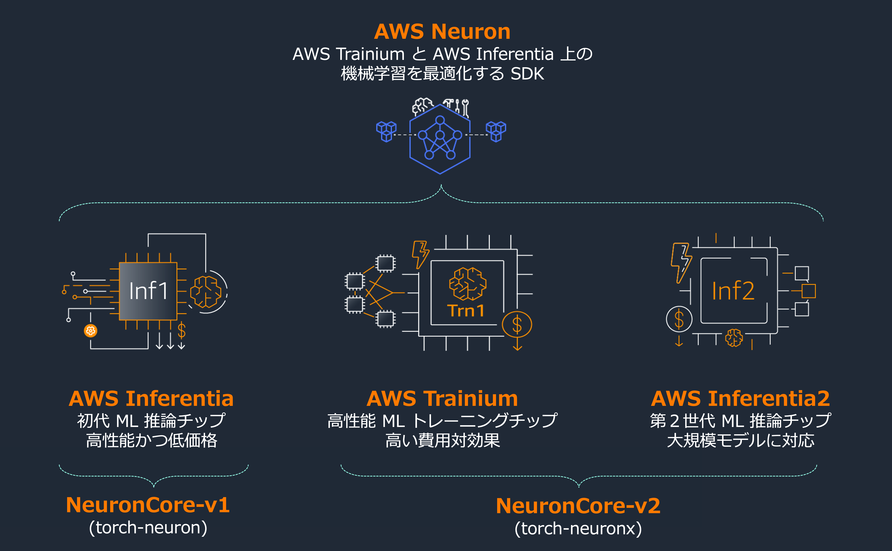

# AWS NEURON JP

[AWS Trainium](https://aws.amazon.com/jp/machine-learning/trainium/)、[AWS Inferentia](https://aws.amazon.com/jp/machine-learning/inferentia/) は、AWSが設計した機械学習アクセラレーターで、クラウドで低コストでコスト効率の高い機械学習トレーニング、推論を可能にします。

## Amazon EC2 Inf1 インスタンス

[Amazon EC２ Inf1](https://aws.amazon.com/jp/ec2/instance-types/inf1/) インスタンスは 2019年12月にローンチした初代 AWS Inferentia を搭載したインスタンスです。これまで [Money Forward 様](https://aws.amazon.com/jp/builders-flash/202209/create-large-scale-inference-environment/)、[ByteDance 様](https://aws.amazon.com/jp/blogs/news/bytedance-saves-up-to-60-on-inference-costs-while-reducing-latency-and-increasing-throughput-using-aws-inferentia/) をはじめとした多くの AWS のお客様に活用頂いているだけではなく、[Amazon Alexa](https://aws.amazon.com/jp/blogs/news/majority-of-alexa-now-running-on-faster-more-cost-effective-amazon-ec2-inf1-instances/)、[Amazon Search](https://aws.amazon.com/jp/blogs/news/how-amazon-search-reduced-ml-inference-costs-by-85-with-aws-inferentia/)、[Amazon Robotics](https://aws.amazon.com/jp/solutions/case-studies/amazon-robotics-case-study/) といった Amazon、AWS が提供しているサービスを支えるインフラとしても活用されています。

## Amazon EC2 Trn1 インスタンス
[Amazon EC２ Trn1](https://aws.amazon.com/jp/ec2/instance-types/trn1/) インスタンスは、大規模言語モデル（LLM）などの生成系 AI モデルのトレーニングに特化した AWS Trainium を搭載したインスタンスです。Trn1 インスタンスは、他の同等の Amazon EC2 のインスタンスと比較して、トレーニングにかかるコストを最大 50% 削減します。 AWS Trainium では第二世代となる [NeuronCore-v2](https://awsdocs-neuron.readthedocs-hosted.com/en/latest/general/arch/neuron-hardware/neuron-core-v2.html) を搭載しています。

## Amazon EC2 Inf2 インスタンス
[Amazon EC２ Inf2](https://aws.amazon.com/jp/ec2/instance-types/inf2/) インスタンスは、第 2 世代の AWS Inferentia アクセラレーターである AWS Inferentia2 を搭載しています。Inf1 インスタンスと比較し、最大 3 倍のコンピューティングパフォーマンス、最大 4 倍のアクセラレーターメモリ、最大 4 倍のスループット、10 分の 1 以下の低レイテンシーを実現します。
AWS Trainium と同じ世代となる NeuronCore-v2 を搭載、推論だけではなく、小規模モデルのファインチューニングも実行可能です。

## AWS Neuron
[AWS Neuron](https://aws.amazon.com/jp/machine-learning/neuron/) は　AWS Trainium、AWS Inferentia 上に機械学習ワークロードを実装する支援をするための SDK です。PyTorch や TensorFlow などのフレームワークとネイティブに統合されるため、既存のコードやワークフローを引き続き利用可能です。
機械学習 (ML) フレームワークやライブラリ、モデルアーキテクチャ、ハードウェア最適化など、現在の Neuron のサポートについては、[AWS Neuron ドキュメント](https://awsdocs-neuron.readthedocs-hosted.com/) をご覧ください。

## :books: 日本語コンテンツ

* [日本語 BERT Base Model Fine-tuning & Deployment on Inferentia2/Trainium](./bertj_finetuning_classification/)
  * 日本語BERTモデルを用いてファインチューニングと推論を同一インスタンス上で通して実行
  * inf2.xlarge もしくは trn1.2xlarge上で実行可能（より大きいサイズのインスタンスでも実行可能）
* [ViT Model Fine-tuning & Deployment on Inferentia2/Trainium](./ViT_finetuning_classification/)
  * Vision Transformer (ViT) モデルを beans データセットを使ってファインチューニングから推論まで同一インスタンス上で通して実行
  * inf2.xlarge もしくは trn1.2xlarge上で実行可能（より大きいサイズのインスタンスでも実行可能）

> [!NOTE]
> コンテンツは Jupyter Nodebook 形式で提供しています。Jupter Notebook 環境のセットアップ方法は[こちら](https://awsdocs-neuron.readthedocs-hosted.com/en/latest/general/setup/notebook/setup-jupyter-notebook-steps-troubleshooting.html)をご参照下さい。

## :books: グローバルコンテンツ

* https://github.com/aws-neuron/aws-neuron-samples/
  * このリポジトリでは、AWS MLアクセラレーターチップ Inferentia と Trainium 上で機械学習推論とトレーニングワークロードを実行する AWS Neuron のサンプルスクリプト（Nodebook）を提供しています。
* https://github.com/aws-samples/ml-specialized-hardware
  * このワークショップでは、AWS Trainium と AWS Inferentia を Amazon SageMaker と Hugging Face Optimum Neuron と一緒に使用して ML ワークロードを最適化する方法を学びます。
* https://github.com/huggingface/optimum-neuron
  * 🤗 Optimum Neuron は、Hugging Face が提供する 🤗 Transformers ライブラリと AWS Trainium や AWS Inferentia などの AWS アクセラレーターとの間のインターフェースです。さまざまなダウンストリームタスクに対してシングル及びマルチアクセラレーターを用いた、モデルの読み込み、トレーニング、推論を簡単に行うためのツールセットを用意しています。検証されたモデルとタスクのリストは、[こちらから](https://huggingface.co/docs/optimum-neuron/package_reference/configuration#supported-architectures)ご覧いただけます。また各種チュートリアルを用意しています。
  * [Create your own chatbot with llama-2-13B on AWS Inferentia](https://huggingface.co/docs/optimum-neuron/tutorials/llama2-13b-chatbot)
  * [Generate images with Stable Diffusion models on AWS Inferentia](https://huggingface.co/docs/optimum-neuron/tutorials/stable_diffusion)
  * [Fine-tune and Test Llama 2 7B on AWS Trainium](https://huggingface.co/docs/optimum-neuron/tutorials/fine_tune_llama_7b)
  * [Fine-tune BERT for Text Classification on AWS Trainium](https://huggingface.co/docs/optimum-neuron/tutorials/fine_tune_bert)

## 🧑‍🤝‍🧑 活用事例

2023年7月に開始した「[AWS LLM 開発支援プログラム](https://aws.amazon.com/jp/local/llm-development-support-program/)」では、基盤モデル開発に挑む 17 社を採択、そのうちの多くが AWS Trainium (Amazon EC2 Trn1 インスタンス）を活用してモデルの開発を行いました。

関連記事

* 2024/02/06 (MONOist) [リコーが130億パラメーターの日英対応LLM開発 AWSジャパンの支援プログラム活用](https://monoist.itmedia.co.jp/mn/articles/2402/06/news075.html)
* 2024/02/01 (EnterpriseZine) [「今年は生成AIの社会実装の年に」と経産省、AWS LLM開発支援プログラムの成果発表会で](https://enterprisezine.jp/news/detail/19146)

参加企業からのPR、技術ブログ

* 2024/02/02 (Watashiha様) inf2用推論スクリプトおよびコンパイル済みモデルを公開（公開モデル [Watashiha-Llama-2-13B-Ogiri-sft-neuron](https://huggingface.co/watashiha/Watashiha-Llama-2-13B-Ogiri-sft-neuron))
* 2024/01/31 (RICOH様) [日本語精度が高い130億パラメータの大規模言語モデル（LLM）を開発](https://jp.ricoh.com/release/2024/0131_1)
* 2024/01/31 (カラクリ様) [カラクリ、700億パラメーターLLM「KARAKURI LM」を一般公開](https://karakuri.ai/seminar/news/karakuri-lm/) (公開モデル [karakuri-lm-70b-v0.1](https://huggingface.co/karakuri-ai/karakuri-lm-70b-v0.1) / [karakuri-lm-70b-chat-v0.1](https://huggingface.co/karakuri-ai/karakuri-lm-70b-chat-v0.1))
* 2024/01/25 (Watashiha様) Llama2-13bに日本語語彙を追加して継続事前学習を行った大喜利言語モデルを公開 (公開モデル [Watashiha-Llama-2-13B-Ogiri-sft](https://huggingface.co/watashiha/Watashiha-Llama-2-13B-Ogiri-sft))
* 2024/01/25 (カラクリ様) [カラクリの700億パラメーターLLM、国産モデルの中で最高性能を獲得](https://karakuri.ai/seminar/news/aws_llm-2/)
* 2024/01/21 (Stockmark様) Inf2用推論スクリプトを公開 ([inferentia2.ipynb](https://huggingface.co/stockmark/stockmark-13b/blob/main/notebooks/inferentia2.ipynb))
* 2023/12/21 (rinna様) [rinna、Qwenの日本語継続事前学習モデル「Nekomata」シリーズを公開](https://rinna.co.jp/news/2023/12/20231221.html) (公開モデル [nekomata-14b](https://huggingface.co/rinna/nekomata-14b))
* 2023/10/26 (Stockmark様) [ビジネスのドメインや最新情報に対応した130億パラメータの日本語LLMの公開](https://tech.stockmark.co.jp/blog/202310_stockmark_13b/) (公開モデル [stockmark-13b](https://huggingface.co/stockmark/stockmark-13b))

## 📝 注目コンテンツ

* Llama2
  * AWSブログ: [AWS Inferentia と AWS Trainium を用いた、AWS SageMaker JumpStart によるコスト最適化された Llama 2 モデルのファインチューニングとデプロイ](https://aws.amazon.com/jp/blogs/news/fine-tune-and-deploy-llama-2-models-cost-effectively-in-amazon-sagemaker-jumpstart-with-aws-inferentia-and-aws-trainium/)
  * [AWS Neuron Reference for NeMo Megatron ライブラリを用いた事前学習チュートリアル](https://github.com/aws-neuron/aws-neuron-parallelcluster-samples/blob/master/examples/jobs/neuronx-nemo-megatron-llamav2-job.md) 
  * [Neuron Distributed ライブラリを用いた事前学習チュートリアル](https://awsdocs-neuron.readthedocs-hosted.com/en/latest/libraries/neuronx-distributed/tutorials/training_llama2_tp_pp.html)
  * [推論 - テキスト生成サンプル](https://github.com/aws-neuron/aws-neuron-samples/blob/master/torch-neuronx/transformers-neuronx/inference/meta-llama-2-13b-sampling.ipynb)
  
* Stable Diffusion
  * AWSブログ: [AWS Inferentia2 で Stable Diffusion のパフォーマンスを最大化し、推論コストを削減する](https://aws.amazon.com/jp/blogs/news/create-high-quality-images-with-stable-diffusion-models-and-deploy-them-cost-efficiently-with-amazon-sagemaker/)
  * [HuggingFace Stable Diffusion 1.5 (512x512)](https://github.com/aws-neuron/aws-neuron-samples/blob/master/torch-neuronx/inference/hf_pretrained_sd15_512_inference.ipynb)
  * [HuggingFace Stable Diffusion 2.1 (512x512)](https://github.com/aws-neuron/aws-neuron-samples/blob/master/torch-neuronx/inference/hf_pretrained_sd2_512_inference.ipynb)
  * [HuggingFace Stable Diffusion 2.1 (768x768)](https://github.com/aws-neuron/aws-neuron-samples/blob/master/torch-neuronx/inference/hf_pretrained_sd2_768_inference.ipynb)
  * [HuggingFace Stable Diffusion XL 1.0 (1024x1024)](https://github.com/aws-neuron/aws-neuron-samples/blob/master/torch-neuronx/inference/hf_pretrained_sdxl_base_and_refiner_1024_inference.ipynb)
