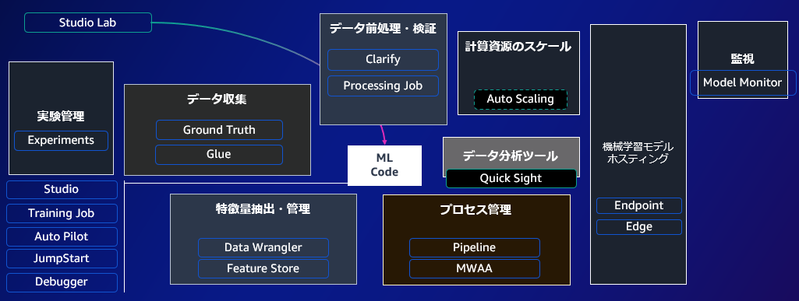

## Amazon SageMaker の概要

[Amazon SageMaker](https://aws.amazon.com/jp/sagemaker/) は機械学習モデル開発を行うための統合開発環境です。 JupyterLab をベースにした環境からデータの前処理、学習、デプロイなどに必要なサービスを簡単に呼び出せます。

[Hidden Technical Debt in Machine Learning Systems](https://papers.nips.cc/paper/5656-hidden-technical-debt-in-machine-learning-systems.pdf) では、機械学習モデルを実際に活用しようとするとモデル本体以上に開発や運用に不可欠なコードが必要と指摘しています。これらは機械学習システムの技術的負債と呼ばれています。 Amazon SageMaker では、「開発や運用に不可欠なコード」をマネージドサービスとして提供することで開発者がモデルの開発に集中できるようにします。下図の「 ML Code 」が機械学習モデルの実装、それを取り囲む黒色のボックスが「開発や運用に不可欠なコード」で、対応する SageMaker サービスをボックス内に記載しています。

* 例えば、データ収集では [Amazon SageMaker Ground Truth](https://aws.amazon.com/jp/sagemaker/data-labeling/) や [AWS Glue](https://aws.amazon.com/jp/glue/) が対応するマネージドサービスになります。

`sagemaker` フォルダでは SageMaker に関連するマネージドサービスの使い方を学べるコードを提供しています。解決したい技術的負債や機械学習モデル開発の改善したいポイントに合わせ参照してください。

* ML Code
   * [Studio](./sagemaker-studio/)
   * [Training Job](./sagemaker-training/)
   * [Auto Pilot](./autopilot/)
   * [JumpStart](./sagemaker-jumpstart/)
   * Debugger
* 実験管理
   * [Experiments](./sagemaker-experiments/)
* データ収集
   * GroundTruth
* 特徴量抽出・管理
   * [Data Wrangler](./sagemaker-data-wrangler/) ※データ収集・前処理にも適したサービスです
   * Feature Store
* データ前処理・検証
   * Clarify
   * [Processing Job](./sagemaker-processing/)
* 機械学習モデルホスティング
   * [Endpoint](./sagemaker-inference/)
* 監視
   * [Model Monitor](./sagemaker-model-monitor/)

SageMaker を使用して機械学習のタスクを解いたり業務の課題を解く方法については以下を参照してください。

* 機械学習タスク別サンプルコード
   * [画像処理](tasks/vision/)
   * [自然言語処理](tasks/nlp/)
   * [音声処理](tasks/audio/)
* 機械学習のユースケース別サンプルコード
   * [ライフサイエンス](use-cases/life-science/)
* 機械学習基盤の構築
   * [MLOps](sagemaker/mlops/)
* 機械学習フレームワークの実装を SageMaker へ移行する
   * [PyTorch](frameworks/pytorch/)
   * [TensorFlow](frameworks/tensorflow/)
   * [AutoGluon](frameworks/autogluon/)
   * [XGBoost](frameworks/xgboost)
   * [PaddlePaddle](frameworks/paddlepaddle/)
