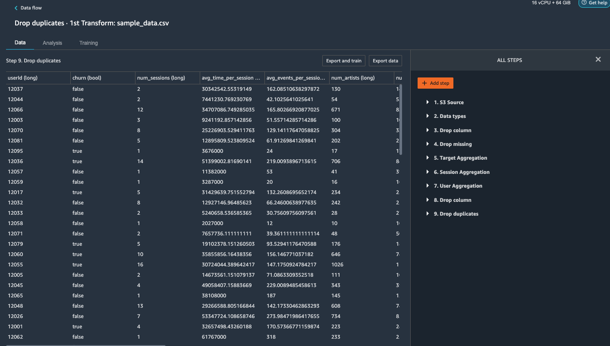

# Amazon SageMaker Data Wrangler for Churn Data Preprocessing

Amazon SageMaker Data Wrangler は、単一のビジュアルインターフェイスからデータ選択、クレンジング、探索、視覚化など、データ準備ワークフローの各ステップを簡素化して実現するツールです。

このサンプルでは、音楽ストリーミングサイトのユーザーアクティビティログから顧客離脱予測に使うための特徴量エンジニアリングを行います。

このサンプルを実行するには、Amazon SageMaker Studio でこの `setup.ipynb` を開いて実行してください。

## License

本リポジトリはMIT-0ライセンスです. [LICENSE](LICENSE) ファイルを確認してください。
