# 本ハンズオンコンテンツについて
本コンテンツではSageMaker JumpStartのFine-Tuneを扱います。Amazon SageMaker Gound Truthを用いて画像にラベル付けを行った後、ラベル付けした画像をJumpStartのObject DetectionモデルにFine-Tuneします。Fine-Tuneを実施する際、以下に記載するAmazon SageMaker トレーニングのいずれかのインスタンスタイプの緩和申請を行う必要があります。事前に実施した上で、本ハンズオンを実施してください。
 

- ml.p3.2xlarge
- ml.p3.16xlarge
- ml.p3dn.24xlarge
- ml.p2.xlarge
- ml.p2.8xlarge
- ml.p2.16xlarge
- ml.g4dn.xlarge
- ml.g4dn.2xlarge
- ml.g4dn.4xlarge
- ml.g4dn.16xlarge
 
 

# ハンズオン手順
本ハンズオンではSageMaker Studioを用います。SageMaker Studioの準備ができている場合は[手順8](#no8)から実施して下さい。

## SageMaker Studioの準備

### 手順1
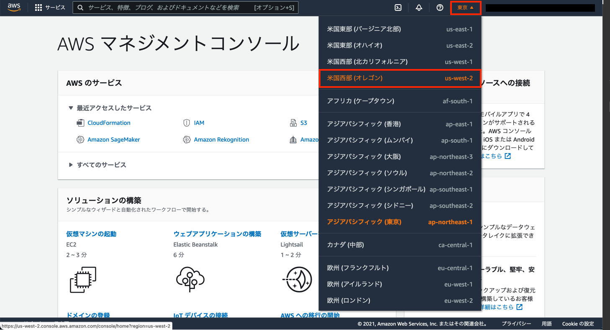
本ハンズオンはAmazon SageMaker Studioを使用できるリージョンで実施して下さい。Amazon SageMaker Studioがサポートされているリージョンは[こちらのドキュメント](https://docs.aws.amazon.com/ja_jp/sagemaker/latest/dg/regions-quotas.html)で確認できます。また、Amazon SageMaker Ground Truthを用いて画像のラベリングの手順も行いたい場合は、SageMaker Ground Truthをサポートしているリージョンを選択して下さい。
本ハンズオンでは例としてオレゴンリージョンを選択します。
 
 

### 手順2
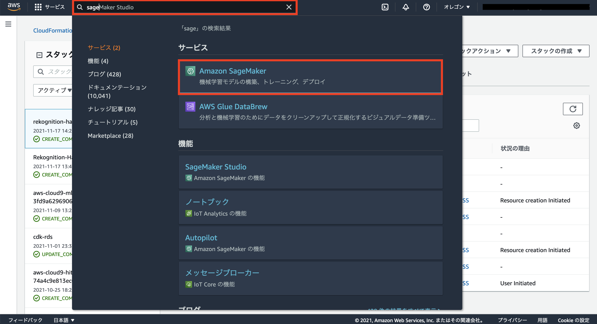
上部中央の検索窓に「Sage」と入力すると「Amazon SageMaker」のリンクが表示されるので押下します。
 
 

### 手順3

画面右側の「SageMaker Studio」を押下します。
 
 

### 手順4

「高速セットアップ」を選択します。次に、「ユーザープロファイル」欄の「デフォルト実行ロール」のプルダウンボタンを選択し、「新しいロールの作成」を押下します。本手順で作成したIAMロールは[手順19](#no19)でも使用するため、名称を控えておいて下さい。
 
 

### 手順5

IAMロールを作成する画面がポップアップされます。「任意のS3バケット」を選択し、「ロールの作成」を押下します。[手順4](#no4)の画面に戻るので、画面右下の「送信」を押下します。
 
 

### 手順6

上記までの手順でSageMaker Studioのドメインが作成されます。StudioのステータスがReadyとなったら、SageMaker Studioにアクセスすることができるユーザープロファイルが作成されています。作成されたユーザープロファイル欄の右側にある「アプリケーションの起動」を押下し、「Studio」を押下します。
 
 

### 手順7

ここまでの手順で、このような画面に遷移します。Jupyuterサーバーのアプリケーションが作成されています。この作成には数分かかります。
 
 

---
## ノートブックの実行方法

### 手順8
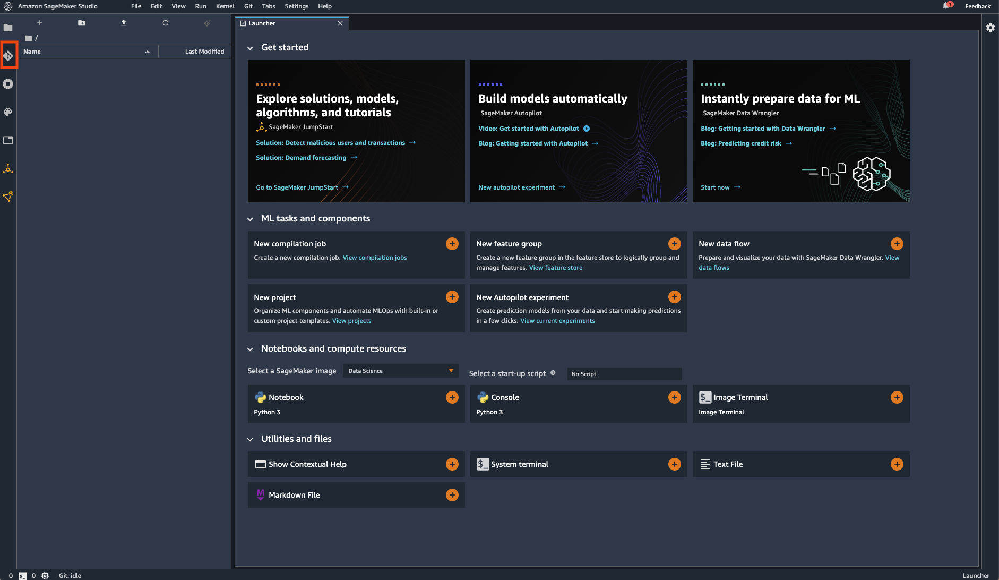
時間が経つとこのような画面に遷移します。次は本ハンズオンを実施するため、gitリポジトリをクローンしましょう。画面左側にあるアイコンの一覧の上から2番目を押下します。
 
 

### 手順9
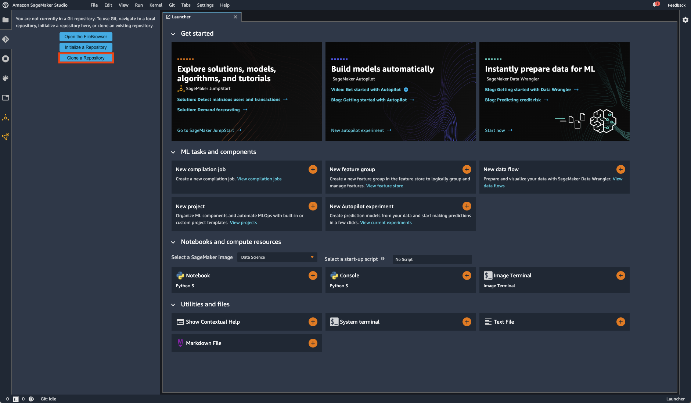 
「Clone Repository」を押下します。
 

### 手順10
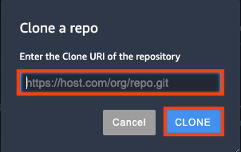
URIに本リポジトリのURL(https://github.com/hitsuji1991/sagemaker-jumpstart-handson.git)を入力し、「CLONE」を押下します。
 
 

### 手順11

ディレクトリに「sagemaker-jumpstart-handson」が作成されていることを確認します。ディレクトリを開き、[jumpstart-object-detection-fine-tune-handson.ipynb](./jumpstart-object-detection-fine-tune-handson.ipynb)を選択します。
 
 

### 手順12
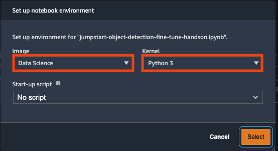
Imageに「Data Science」を、Kernelに「Python 3」を選択し、「Select」を押下します。
 
 

### 手順13

カーネルの作成が終わるとこのような画面となります。ここからはipynbの内容に従ってハンズオンを進めて下さい。

---
## プライベートチームの作成手順

### 手順14
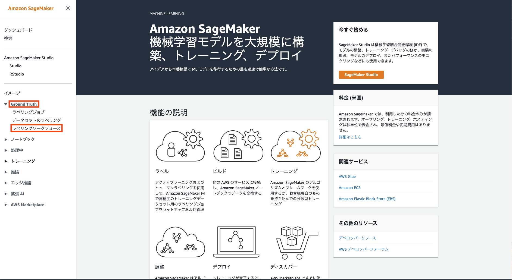
SageMakerのページを開き、左側の「Ground Truth」にある「ラベリングワークフォース」を選択します。
 
 

### 手順15

「プライベート」を選択し、「プライベートチームを作成」を押下します。
 
 

### 手順16
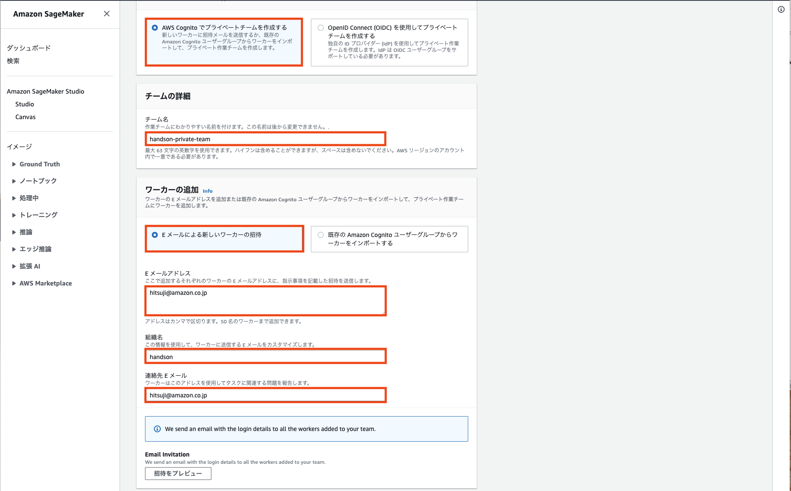
「AWS Cognitoでプライベートチームを作成する」を選択します。プライベートチーム名を任意の名前で設定します。その後、プライベートチームにワーカーを追加します。ワーカーとは、Ground Truthを用いてラベリング作業をする人のことを指します。「Eメールによる新しいワーカーの招待」を選択し、Eメールアドレスの欄にワーカーとして追加したい人のメールアドレスを記載します。複数人追加したい場合はメールアドレスをカンマで区切って追加します。次に組織名を任意で設定します。この組織名はワーカーにメールを送信する際、ワーカー側で表示される名称となります。最後に、連絡先Eメールアドレスを設定します。この連絡先Eメールアドレスは、ワーカーと同一でも構いません。最後に、画面下の「プライベートチームの作成」を押下します。

---
## ラベリングジョブの作成手順

### 手順17

SageMakerのページを開き、左側の「Ground Truth」にある「ラベリングジョブ」を選択します。
 
 

### 手順18
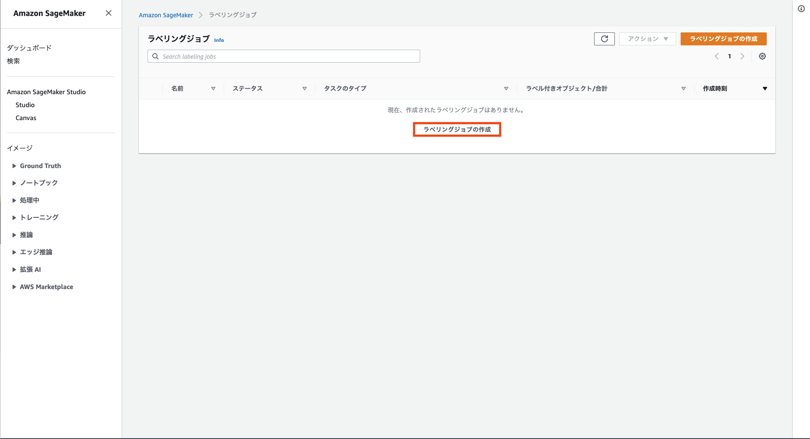
「ラベリングジョブの作成」を押下します。
 
 

### 手順19
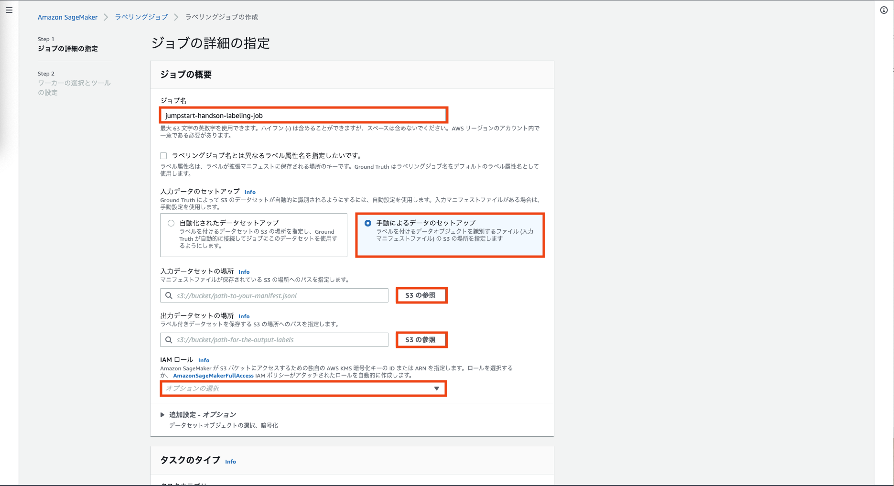
ジョブ名に任意の名称を設定します。**この名称は後で変更・削除できない点に注意して下さい。**「手動によるデータのセットアップ」を選択します。次に、以下を入力データセットのパスに指定します。   
/jumpstart-finetune-handson****/bounding_box/manifest.json   
次に、以下を出力データセットのパスに指定します。   
/jumpstart-finetune-handson****/bounding_box/ground_truth   
次に、[手順4](#no4)で作成したIAMロールを指定します。
 
 

### 手順20

タスクのタイプで「境界ボックス」を選択します。画面を下にスクロールし、「次へ」を押下します。
 
 

### 手順21

ワーカータイプに「プライベート」を選択します。プライベートチームに[手順16](#no16)で作成したプライベートチームを指定します。
 
 

### 手順22

タスクの簡単な説明を入力します。その後、「usb-a」「usb-c」「lightning」のラベルを追加します。その後「作成」を押下します。

---
## ラベリングジョブの実施手順

### 手順23
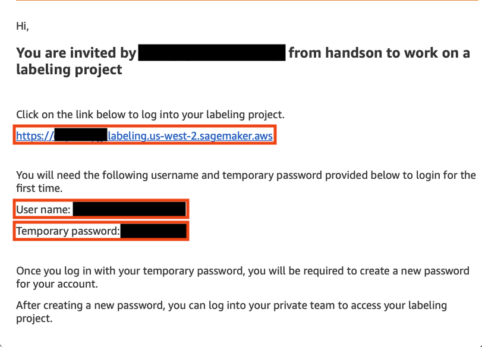
[手順16](#no16)で設定したワーカーのアドレスに、上記のメールが届いていることを確認します。User nameとTemporary passwordを控えておきます。Labeling projectのURLを押下します。
 
 

### 手順24

[手順23](#no23)で控えておいたUser nameとTemporary passwordを入力し、「Sing In」を押下します。
 
 

### 手順25

ラベリングジョブが追加されていることを確認します。画面右上の「Start working」を押下します。
 
 

### 手順26

ラベリング作業を実施する画面が表示されます。ここで画像をラベリングしていきます。ラベリングが終了したら右下の「submit」を押下し、次の画像をラベリングします。ラベリングする画像は全部で35枚あります。本ハンズオンは全てラベリングする必要はなく、途中で作業を中断しSageMaker JumpStartのFine-Tuneの手順へ移行することが可能です。

---
## Fine-Tuneの実施手順

### 手順27

SageMaker Studioの画面左側のアイコンリストの下から2番目を選択します。「SAGEMAKER JUMPSTART LAUNCH ASSETS」という画面が出てくるので、その中の「Browse JumpStart」を押下します。
 
 

### 手順28

JumpStartの一覧が表示されます。画面上部の検索窓に「object detection」と入力し、Enterキーを押下します。
 
 

### 手順29

検索結果から「SSD Mobile Net１.0」を押下します。
 
 

### 手順30

Fine-Tuneを行うため、まだモデルのデプロイは実施しません。画面を下にスクロールし、Train Modelの設定を行い、Fine-Tuneを実行します。Data Sourceに「Find S3 bucket」を選択します。S3 bucket nameには一覧から本ハンズオンで作成したS3 bucket(jumpstart-finetune-handson***)を選択します。その後、Dataset directory nameに以下を選択します。   
bounding_box/taining/
次に、Deployment Configurationを設定します。SageMaker Training Instanceに制限緩和を実施したインスタンスを指定します。
 

続けて、Hyper-parametersを設定します。Epochsを30に設定します。最後に「Train」を押下します。
 
 

### 手順32

Fine-Tuneが開始されます。StatusがCompleteとなるまで待ちます。

---
## モデルのデプロイ手順

### 手順33

[手順32](#no32)を実施後、StatusがCompleteとなったらモデルのデプロイ作業に進みます。
 
 

### 手順34

モデルをデプロイするインスタンスを設定します。インスタンスは「ml.m5.large」とします。本インスタンスは制限緩和を実施することなく使用することができます。詳細は[Amazon SageMakerエンドポイントとクォータ](https://docs.aws.amazon.com/ja_jp/general/latest/gr/sagemaker.html#:~:text=0-,ml.m5.large%20%E3%82%A4%E3%83%B3%E3%82%B9%E3%82%BF%E3%83%B3%E3%82%B9,-2)を参照して下さい。
 
 

### 手順35
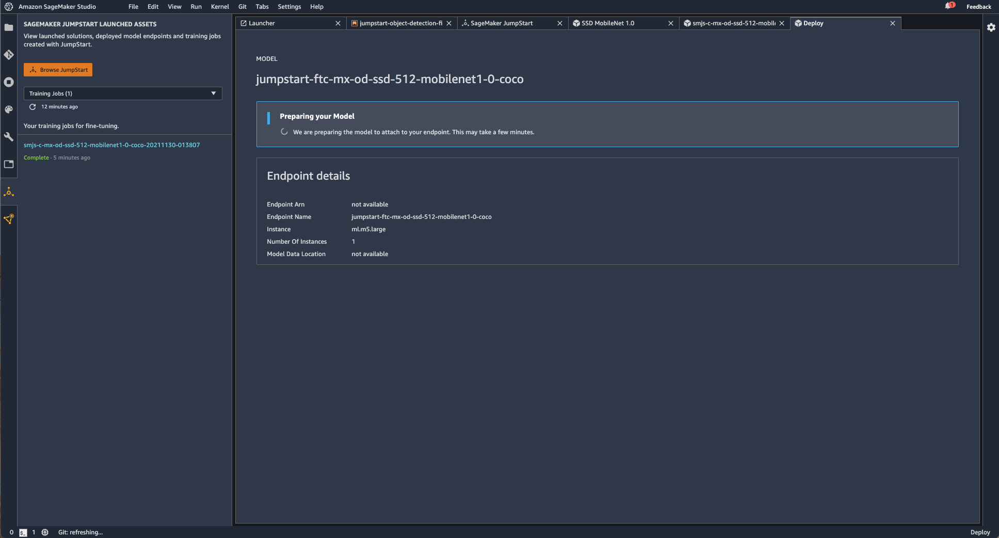
モデルの作成に入ります。少し時間が経つとモデルのデプロイが完了します。
 
 

### 手順36
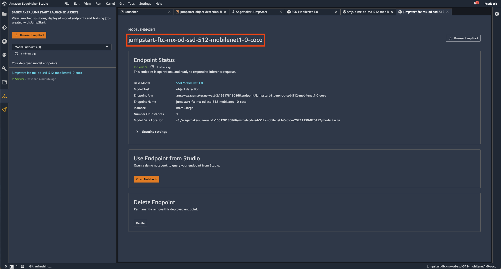
モデルのデプロイが完了したら、モデルのエンドポイント名を控えておきます。

---
## 後片付け

本ハンズオンで作成したリソースを削除して下さい。削除するリソースは以下です。
- 推論エンドポイント
- SageMaker Studio
- 本ハンズオンで作成したS3バケット(jumpstart-finetune-handson\*\*\*, sagamaker-studio-****)
- EFS 