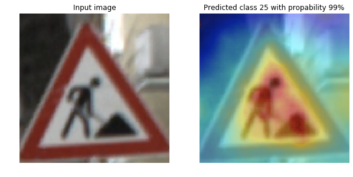

## Amazon SageMaker Model Monitor と Debugger を使って不正な予測を検知して分析する

このリポジトリには、「Amazon SageMaker Model Monitor と Debugger を使って不正な予測を検知して分析する」のノートブックとスクリプトが含まれています。

[SageMaker notebook instance](https://docs.aws.amazon.com/sagemaker/latest/dg/howitworks-create-ws.html)を作成し、このリポジトリをcloneしてください。

[analyze_model_predictions.ipynb](analyze_model_predictions.ipynb)では、最初に[German Traffic Sign dataset](https://ieeexplore.ieee.org/document/6033395)を使用して43のカテゴリの交通標識を分類するように学習した[ResNet18](https://arxiv.org/abs/1512.03385)モデルをデプロイします。

[SageMaker Model Monitor](https://aws.amazon.com/blogs/aws/amazon-sagemaker-model-monitor-fully-managed-automatic-monitoring-for-your-machine-learning-models/)をセットアップして、推論リクエストと予測を自動的にキャプチャします。その後、収集されたデータを検査し、予期しないモデルの動作を検出するために、カスタムProcessingジョブを定期的に実行する[monitoring schedule](https://docs.aws.amazon.com/sagemaker/latest/dg/model-monitor-scheduling.html)を起動します。
 
次に、モデルが誤った予測を行うことにつながる敵対的な画像を作成します。Model Monitorがこの問題を検出したら、[SageMaker Debugger](https://aws.amazon.com/blogs/aws/amazon-sagemaker-debugger-debug-your-machine-learning-models/)を使用して、デプロイされたモデルの視覚的な説明を取得します。これは、推論中にテンソルを出力するようにエンドポイントを更新することによって行われます。次に、それらのテンソルを使用して顕著性(saliency)マップを計算します。

顕著性(saliency)マップはヒートマップとしてレンダリングでき、予測で重要だった画像の部分を明らかにします。以下は[German Traffic Sign dataset](http://benchmark.ini.rub.de/?section=gtsrb&subsection=dataset)から抜粋した例です。左側の画像は、画像クラス25（「Road work(道路工事)」）を予測したfine tuningされたResNetモデルへの入力です。右の画像は、ヒートマップでオーバーレイされた入力画像を示しています。ここで、赤はクラス25を予測する上での最も関連性の高いピクセルを示し、青はクラス25を予測する上での最も関連性の低いピクセルを示します。

## License

This project is licensed under the Apache-2.0 License.

